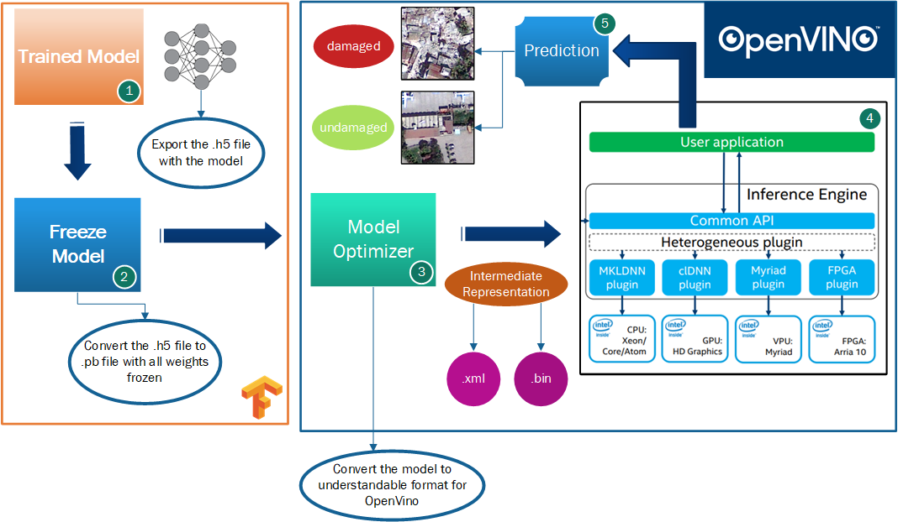
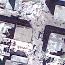
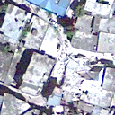
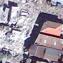
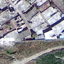
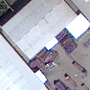
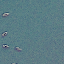
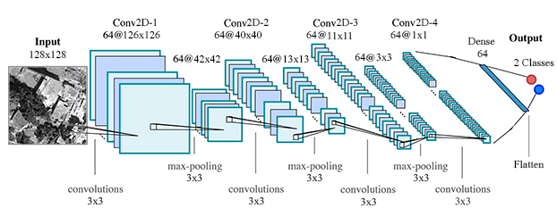

# **Image Binary Classification Model for Rapid Damage Detection in Earthquakes using OpenVino Toolkit**
This repository is part of my bachelor´s degree project. This is focused on the analysis and enhancement of all the processes related to the generation and implementation of a Convolutional Neural Network.

Through this technique belonging to the field of Deep Learning, it has been possible to design an application which allows us to detect whether there are damaged zones for an earthquake impact in an image. Therefore, it is used a specific topology for this problem. Specifically, the images used are provided by the earthquake occurred in Haití in 2010, obtained from an earth observation satellite called GeoEye-1.

As an example, the images have this look:

Being the main goal to implement this neural network in Intel´s devices. Hence, we will use the [OpenVino Toolkit](https://software.intel.com/en-us/openvino-toolkit) to obtain a multiplatform and optimized model to be used in Intel´s hardware.
## **Neural Network**
This CNN (Convolutional Neural Network) is deployed in Keras by [Tensorflow](https://www.tensorflow.org/api_docs/python/tf) using Python. The version of Tensorflow is **2.2** for development, but for OpenVino, the **v2.0** is needed (check the rest of tools and dependencies in OpenVino´s website). This model is formed by the next layers:

## **Folder structure**
This is how the repository is structured:
- **OpenVINO/:** All the content related to the inference phase.
    - **Python/:** Include all the scripts related to the inference phrase (including the video).
    - **IR/:** Models in Intermediate Representation form.
- **Serving/profiler/:** Reports made for getting the execution time of Serving´s inference. These are profiler files in Tensorboard format.
- **docs/:** Additional files for some images or additional content in the README file.
- **model/:** All the content related to the training phase.
    - **Frozen/:** Serialized models and the scripts which make this process.
    - **logs/:** Reports about the training phase (graphics of accuracy, loss and so on) in Tensorboard format.
    - **model/:** Models stored in the training phase.
    - **weights/:** Weights of the models stored in the training phase.
- **samples/:** Sample images provided by the earth observation satellite, GeoEye-1.
## **Software**
- I´m using [Google Colab](https://colab.research.google.com/) as my development environment.
- Remote Environment
    - OS: Ubuntu 18.04
    - Python 3.6.8
    - OpenVino 2020.2
## **Hardware**
- Remote Environment (Inferece Phase)
    - CPU: Intel(R) Xeon(R) CPU E3-1225 v3 @ 3.20GHz
    - VPU: Intel Movidius Myriad X VPU

## **Documentation**
This work is based on a project developed by K. J. Somaiya College of Engineering, Vidyavihar, Mumbai & Centre of Studies in Resources Engineering, IIT Bombay, Powai, Mumbai (India). This is the [paper](docs/paper.pdf) that I´ve been following.

## **LICENSE**
