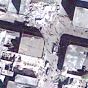
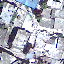
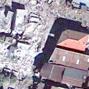
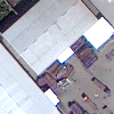

# **Deep Learning | Image Binary Classification Model for Quick Detection of Earthquakes using Intel OpenVino Toolkit**

This repository is part of my end-of-degree´s project. The idea is about take some images with damaged or not areas and identify which one of these owns each category (damaged,undamaged).

As an example, the images have this look:

The main goal is to implement this neural network in Intel´s devices. Hence, we will use the [OpenVino Toolkit](https://software.intel.com/en-us/openvino-toolkit) to obtain a multiplatform and optimized model to be used in Intel´s hardware.
## **Neural Network**
This CNN (Convolutional Neural Network) is deployed in Keras by [Tensorflow](https://www.tensorflow.org/api_docs/python/tf) using Python. The version of Tensorflow is **2.0** for development, but for OpenVino, the **v1.15** is needed (check the rest of tools and dependencies in OpenVino´s web). This model is formed by the next layers:

## **Software**
- I´m using [Google Colab](https://colab.research.google.com/) as my development environment.
- Local Environment
    - OS: Windows 10 Home
    - Python 3.7.4 64-bits
    - OpenVino 2019 R3.1
- Remote Environment
    - OS: Ubuntu 18.04
    - Python 3.6.8
    - OpenVino 2020 1
## **Hardware**
- Local Environment
    - CPU: Intel i7-6700HQ @2.60GHz - 4 Cores
    - GPU: Intel HD Graphics 530 | NVIDIA GTX-950M
    - RAM: 12GB DDR4
- Remote Environment
    - CPU: Intel(R) Xeon(R) CPU E3-1225 v3 @ 3.20GHz
    - VPU: Intel Movidius Myriad X VPU

## **Documentation**
This work is based on a project developed by K. J. Somaiya College of Engineering, Vidyavihar, Mumbai & Centre of Studies in Resources Engineering, IIT Bombay, Powai, Mumbai(India).This is the [paper](docs/paper.pdf) that i´ve been following.

## **LICENSE**
